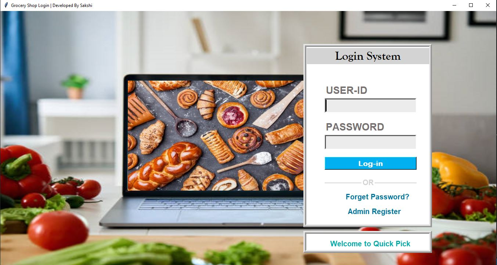

# 🛒 Quick Pick – Smart Grocery Management System

> “Not just a system — your **digital shop assistant.**”

**Quick Pick** is a feature-rich desktop application designed to automate grocery store operations — from inventory to billing — all in one sleek, speech-assisted interface. Built with **Python’s Tkinter** and **SQLite**, it's crafted to bring big-store intelligence to small-to-medium-sized retailers.

---

## ✨ Why Quick Pick is Unique

✅ **Speech Feedback at Every Step**  
Unlike most traditional POS systems, Quick Pick offers **real-time text-to-speech guidance**, making it accessible for users with low literacy or visual challenges.

✅ **Role-Based Login with Security Layers**  
Separate **Admin/Employee** access levels, OTP-based **password recovery**, and data validation ensure **secure multi-user functionality**.

✅ **Real-Time, Local-first Performance**  
No internet? No problem. Quick Pick is **fully offline**, blazing fast, and **portable across systems** thanks to SQLite.

✅ **One Dashboard. Every Detail.**  
Track sales, staff, inventory, categories, and suppliers in a unified, modern dashboard — with visual counts and voice summaries.

✅ **Print-Ready Billing + Built-In Calculator**  
Generate formatted, savable invoices — while managing the cart using an embedded calculator interface.

---

## 🔐 Login System

- Secure access via employee ID & password  
- OTP-based “Forget Password” flow using SMTP  
- Animated interface & TTS welcome messages

---

## 📦 Modules Overview

### 🛍️ **Product Management**
- Add/edit/delete/search products  
- Category/supplier linkage  
- Stock status indicators

### 👥 **Employee Records**
- Full CRUD for employee profiles  
- Gender, salary, DOB, DOJ, password validations  
- Role-based permissions (Admin/Employee)

### 🚚 **Supplier Management**
- Capture GST, contact, and email details  
- Search and filter suppliers instantly

### 🧾 **Billing + Sales**
- Real-time cart management  
- Auto-invoice with saving & reloading  
- Print support via system printer

### 📁 **Category Handling**
- Create/delete product categories  
- Dynamically linked with product UI

---

## 🧠 Tech Stack

| Layer          | Tech                    |
|----------------|-------------------------|
| UI             | Python (Tkinter)        |
| Voice Support  | pyttsx3                 |
| Email OTP      | smtplib                 |
| DB             | SQLite                  |
| Assets         | PNG (UI images), Pillow |

---

